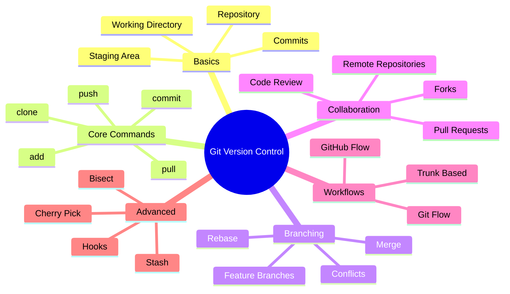

# Understanding Git: A Visual Guide

Git is a **distributed version control system** that helps developers track changes in their code, collaborate with others, and manage different versions of their projects. Whether you're working solo or on a team, Git is an essential tool in modern software development.

## What is Version Control?

Version control is like having an "undo" button on steroids for your entire project. It lets you:
- Track every change made to your code
- See who made what changes and when
- Revert to previous versions if something breaks
- Work on multiple features simultaneously
- Collaborate with others without conflicts

## Why Git?

Git has become the industry standard because it's:
- **Distributed**: Every developer has a complete copy of the project history
- **Fast**: Most operations happen locally on your machine
- **Flexible**: Supports many different workflows
- **Powerful**: Handles projects of any size efficiently
- **Popular**: Used by millions of developers worldwide

## Git Mindmap Overview

Here's a high-level view of what you'll learn in this guide:

## How This Guide Works

Each section of this guide covers a different aspect of Git, with visual diagrams to help you understand the concepts. By the end, you'll have a solid foundation in Git and be ready to use it confidently in your projects.

Let's start by understanding Git's basic architecture and how it thinks about your files.
