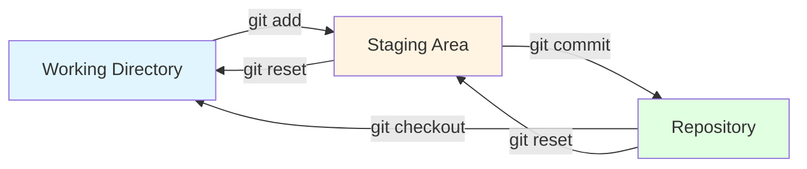

# The Three Areas of Git

Understanding Git's architecture is crucial to using it effectively. Git organizes your work into **three main areas**, and files flow between them as you work.

## The Three Areas Explained

1. **Working Directory** (or Working Tree)
   - This is your actual project folder with all your files
   - Where you make changes, edit files, and create new ones
   - Files here can be modified, untracked, or unchanged

2. **Staging Area** (or Index)
   - A holding area for changes you want to include in your next commit
   - Think of it as a "draft" of your next snapshot
   - You explicitly choose what goes here using `git add`

3. **Repository** (or Commit History)
   - The permanent record of your project's history
   - Contains all commits (snapshots) you've made
   - Stored in the `.git` directory

## How Files Flow Between Areas



## Understanding the Flow

**Forward Flow** (saving your work):
- Edit files in your **Working Directory**
- Stage changes with `git add` → moves to **Staging Area**
- Commit staged changes with `git commit` → saves to **Repository**

**Backward Flow** (retrieving old work):
- `git checkout` - Replace working files with a commit
- `git reset` - Move changes back from staging or repository

## Why Three Areas?

This three-stage design gives you precise control:
- **Flexibility**: You can stage only some of your changes
- **Review**: You can review what's staged before committing
- **Organization**: Group related changes into logical commits
- **Safety**: Your committed history is protected from accidental changes

## Example Workflow

```bash
# 1. Make changes in working directory
echo "Hello World" > hello.txt

# 2. Stage the changes
git add hello.txt

# 3. Commit to repository
git commit -m "Add hello world file"
```

Understanding these three areas is fundamental to mastering Git. Every Git command you use will interact with one or more of these areas.
