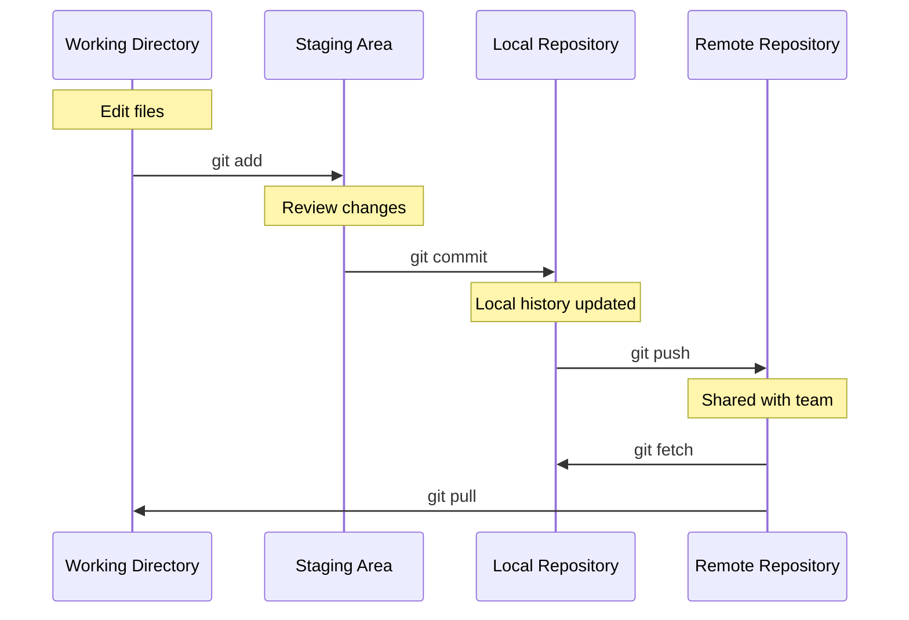

# Essential Git Commands

Let's explore the core commands you'll use daily when working with Git. These commands form the foundation of your Git workflow.

## The Basic Command Flow



## Command Reference

### Starting a Repository

**`git init`** - Create a new Git repository
```bash
git init my-project
cd my-project
```

**`git clone`** - Copy an existing repository
```bash
git clone https://github.com/user/repo.git
```

### Making Changes

**`git status`** - See what's changed
```bash
git status
# Shows: modified files, staged files, untracked files
```

**`git add`** - Stage changes for commit
```bash
git add file.txt          # Stage specific file
git add .                 # Stage all changes
git add *.js              # Stage all JavaScript files
```

**`git commit`** - Save staged changes
```bash
git commit -m "Fix login bug"           # With message
git commit -am "Quick fix"              # Stage + commit tracked files
```

### Viewing History

**`git log`** - View commit history
```bash
git log                                 # Full history
git log --oneline                       # Compact view
git log --graph --all                   # Visual branch graph
```

**`git diff`** - See what changed
```bash
git diff                                # Unstaged changes
git diff --staged                       # Staged changes
git diff HEAD~1                         # Compare with previous commit
```

### Syncing with Remote

**`git push`** - Upload commits to remote
```bash
git push origin main                    # Push to main branch
git push -u origin feature              # Set upstream and push
```

**`git pull`** - Download and merge remote changes
```bash
git pull origin main                    # Fetch + merge
```

**`git fetch`** - Download remote changes without merging
```bash
git fetch origin                        # Just fetch, don't merge
```

## Common Workflow Pattern

```bash
# 1. Check current status
git status

# 2. Make your changes
# (edit files in your editor)

# 3. Review what changed
git diff

# 4. Stage changes
git add .

# 5. Commit with descriptive message
git commit -m "Add user authentication feature"

# 6. Push to remote
git push origin main
```

## Best Practices

- **Commit often**: Small, focused commits are better than large ones
- **Write clear messages**: Future you will thank present you
- **Review before committing**: Use `git diff --staged` to check what you're about to commit
- **Pull before push**: Avoid conflicts by staying up to date

These commands will handle 90% of your daily Git needs. Master them, and you'll be productive with Git!
