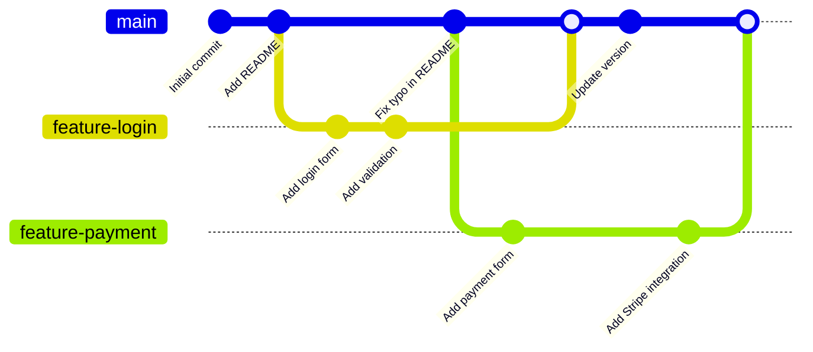

# Branching: Git's Killer Feature

Branches are one of Git's most powerful features. They let you diverge from the main line of development and work on different features, bug fixes, or experiments independently—without affecting the main codebase.

## What is a Branch?

A branch is simply a **movable pointer** to a commit. When you create a branch, you're creating a new pointer that you can move independently. The default branch is typically called `main` (or `master` in older repositories).

## Branch Visualization



## Common Branch Commands

### Creating and Switching Branches

```bash
# Create a new branch
git branch feature-user-profile

# Switch to a branch
git checkout feature-user-profile

# Create and switch in one command
git checkout -b feature-user-profile

# Modern alternative (Git 2.23+)
git switch -c feature-user-profile
```

### Viewing Branches

```bash
# List all local branches
git branch

# List all branches (local and remote)
git branch -a

# See which branch you're on
git status
```

### Merging Branches

```bash
# Switch to the branch you want to merge INTO
git checkout main

# Merge another branch into current branch
git merge feature-user-profile
```

### Deleting Branches

```bash
# Delete a local branch (after merging)
git branch -d feature-user-profile

# Force delete (if not merged)
git branch -D feature-user-profile

# Delete a remote branch
git push origin --delete feature-user-profile
```

## Why Use Branches?

**Isolation**: Work on features without affecting the main codebase
```bash
git checkout -b experiment
# Try crazy ideas safely!
```

**Collaboration**: Multiple developers can work simultaneously
```bash
# Developer A
git checkout -b feature-A

# Developer B
git checkout -b feature-B
```

**Organization**: Separate different types of work
- `feature/*` - New features
- `bugfix/*` - Bug fixes
- `hotfix/*` - Urgent production fixes
- `release/*` - Release preparation

## Branch Workflow Example

```bash
# Start new feature
git checkout -b feature-dark-mode

# Make changes and commit
git add styles.css
git commit -m "Implement dark mode toggle"

# More work...
git add app.js
git commit -m "Save dark mode preference"

# Ready to merge back to main
git checkout main
git merge feature-dark-mode

# Clean up
git branch -d feature-dark-mode
```

## Best Practices

1. **Keep branches short-lived**: Merge frequently to avoid divergence
2. **Use descriptive names**: `feature-user-auth` not `fix-stuff`
3. **One branch per feature/fix**: Don't mix unrelated changes
4. **Sync with main regularly**: Pull main into your branch to stay current
5. **Delete merged branches**: Keep your branch list clean

Branches are lightweight and cheap in Git—create them freely and merge often!
