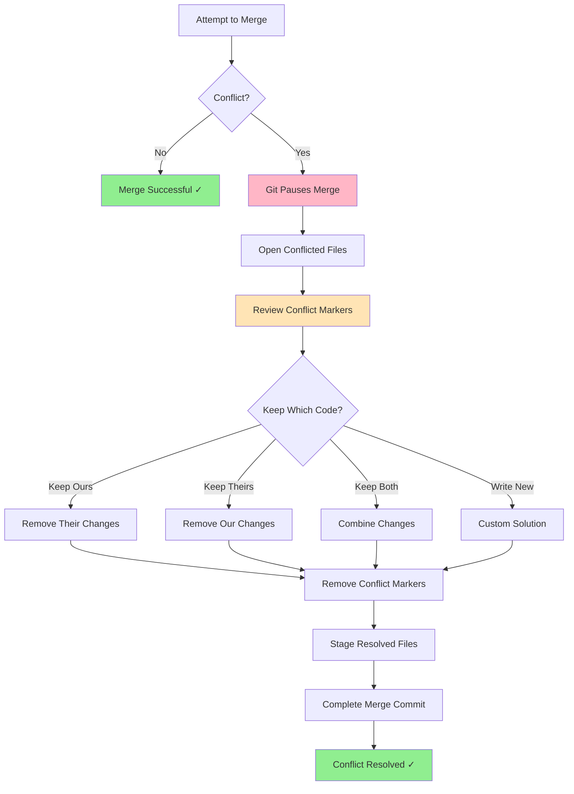

# Handling Merge Conflicts

Merge conflicts occur when Git can't automatically resolve differences between two commits. While they might seem scary at first, conflicts are a normal part of collaborative development and are straightforward to resolve once you understand them.

## When Do Conflicts Happen?

Conflicts occur when:
- Two branches modify the **same lines** of the same file
- One branch deletes a file while another modifies it
- Both branches create a file with the same name but different content

## Conflict Resolution Flow



## Understanding Conflict Markers

When Git encounters a conflict, it marks the conflicting section in your file:

```
<<<<<<< HEAD (Current Change)
const greeting = "Hello World";
=======
const greeting = "Hi There";
>>>>>>> feature-branch (Incoming Change)
```

**Breaking it down:**
- `<<<<<<< HEAD` - Start of your current branch's version
- `=======` - Separator between versions
- `>>>>>>> feature-branch` - End of the incoming branch's version

## Resolving Conflicts Step-by-Step

### Step 1: Identify Conflicts

```bash
# Attempt merge
git merge feature-branch

# Git will tell you about conflicts
# CONFLICT (content): Merge conflict in app.js
```

### Step 2: View Conflicted Files

```bash
# See which files have conflicts
git status

# Output shows:
# Unmerged paths:
#   both modified:   app.js
```

### Step 3: Open and Edit Conflicted Files

Open `app.js` and you'll see:
```javascript
function getUserName() {
<<<<<<< HEAD
  return user.fullName;
=======
  return user.firstName + " " + user.lastName;
>>>>>>> feature-branch
}
```

### Step 4: Choose Your Resolution

**Option A: Keep your version**
```javascript
function getUserName() {
  return user.fullName;
}
```

**Option B: Keep their version**
```javascript
function getUserName() {
  return user.firstName + " " + user.lastName;
}
```

**Option C: Combine both**
```javascript
function getUserName() {
  // Use fullName if available, otherwise construct it
  return user.fullName || user.firstName + " " + user.lastName;
}
```

### Step 5: Complete the Merge

```bash
# Stage the resolved file
git add app.js

# Complete the merge
git commit -m "Merge feature-branch, resolve getUserName conflict"
```

## Avoiding Conflicts

While conflicts are normal, you can minimize them:

1. **Communicate with your team**: Coordinate who's working on what
2. **Pull frequently**: Stay up-to-date with the main branch
3. **Make small, focused commits**: Easier to merge and resolve
4. **Work on different files**: Organize work to minimize overlap
5. **Use feature branches**: Isolate changes until ready

## Aborting a Merge

If you're overwhelmed, you can always back out:

```bash
# Abort the merge and return to pre-merge state
git merge --abort
```

## Using Merge Tools

Many developers use visual merge tools:

```bash
# Configure a merge tool (example: VS Code)
git config --global merge.tool vscode

# Launch merge tool
git mergetool
```

Visual merge tools show three panes:
- **Left**: Your version
- **Middle**: Result
- **Right**: Their version

## Best Practices

- **Don't panic**: Conflicts are normal and fixable
- **Test after resolving**: Make sure the code still works
- **Ask for help**: If unsure, discuss with the other developer
- **Keep backups**: You can always `git merge --abort` and try again
- **Use tools**: Visual merge tools can make resolution easier

Remember: Conflict markers (`<<<<<<<`, `=======`, `>>>>>>>`) must be completely removed before committing!
