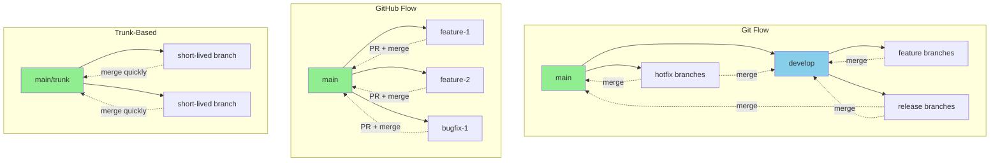

# Git Workflows: Team Collaboration Strategies

Different teams use different strategies for organizing their Git usage. These workflows define how branches are created, named, and merged. Choosing the right workflow depends on your team size, release schedule, and project complexity.

## Common Git Workflows Comparison



## 1. Git Flow

**Best for**: Large projects with scheduled releases

### Branch Structure

- `main` - Production-ready code
- `develop` - Integration branch for features
- `feature/*` - New features (branch from develop)
- `release/*` - Release preparation (branch from develop)
- `hotfix/*` - Emergency fixes (branch from main)

### Typical Flow

```bash
# Start new feature
git checkout develop
git checkout -b feature-user-dashboard

# Work on feature
git commit -m "Add dashboard layout"
git commit -m "Add user stats"

# Finish feature
git checkout develop
git merge feature-user-dashboard
git branch -d feature-user-dashboard

# Prepare release
git checkout -b release-1.2.0
# Make release-specific changes
git checkout main
git merge release-1.2.0
git tag -a v1.2.0 -m "Version 1.2.0"

# Merge back to develop
git checkout develop
git merge release-1.2.0
```

**Pros:**
- Clear separation between development and production
- Supports scheduled releases
- Easy to maintain multiple versions

**Cons:**
- More complex
- Can slow down fast-moving teams
- Requires discipline

## 2. GitHub Flow

**Best for**: Continuous deployment, web applications

### Branch Structure

- `main` - Always deployable
- `feature/*` - Any change (features, fixes, etc.)

### Typical Flow

```bash
# Create feature branch
git checkout -b feature-add-comments

# Make changes and push
git commit -m "Add comment form"
git push origin feature-add-comments

# Open Pull Request on GitHub
# Team reviews code
# Tests run automatically

# After approval, merge to main
# Deploy main to production

# Delete branch
git branch -d feature-add-comments
```

**Pros:**
- Simple and easy to learn
- Fast deployment cycle
- Pull Requests enable code review
- Main branch always deployable

**Cons:**
- Requires good CI/CD setup
- No staging environment by default
- Less suitable for scheduled releases

## 3. Trunk-Based Development

**Best for**: High-performing teams, continuous integration

### Branch Structure

- `main/trunk` - Single source of truth
- Very short-lived feature branches (hours or days)

### Typical Flow

```bash
# Pull latest
git pull origin main

# Create very small branch
git checkout -b quick-fix

# Make minimal change
git commit -m "Fix button alignment"

# Push and merge same day
git push origin quick-fix
# Quick review, then merge

# Delete immediately
git branch -d quick-fix
```

**Pros:**
- Simplest workflow
- Encourages small changes
- Fast integration
- Reduces merge conflicts

**Cons:**
- Requires feature flags for incomplete work
- Needs strong testing automation
- Higher discipline required

## Choosing a Workflow

### Consider:

**Team Size:**
- Small (1-5): GitHub Flow or Trunk-Based
- Medium (5-20): GitHub Flow
- Large (20+): Git Flow or scaled variant

**Release Cycle:**
- Continuous: GitHub Flow or Trunk-Based
- Scheduled: Git Flow
- Mobile apps: Git Flow (app store review time)

**Team Experience:**
- Beginners: GitHub Flow
- Experienced: Any workflow
- Mixed: GitHub Flow

## Hybrid Approaches

Many teams adapt workflows to their needs:

```bash
# Example: GitHub Flow + Release Branches
main              # Production
  ├── feature-A   # Feature work
  ├── feature-B   # Feature work
  └── release-1.5 # Stabilization before release
```

## Best Practices (All Workflows)

1. **Keep branches short-lived**: Merge frequently
2. **Write clear commit messages**: Help your team understand changes
3. **Use Pull Requests**: Enable code review and discussion
4. **Automate testing**: Catch issues before merging
5. **Document your workflow**: Ensure team alignment
6. **Stay flexible**: Adapt as your team grows

The best workflow is the one your team actually follows consistently!
