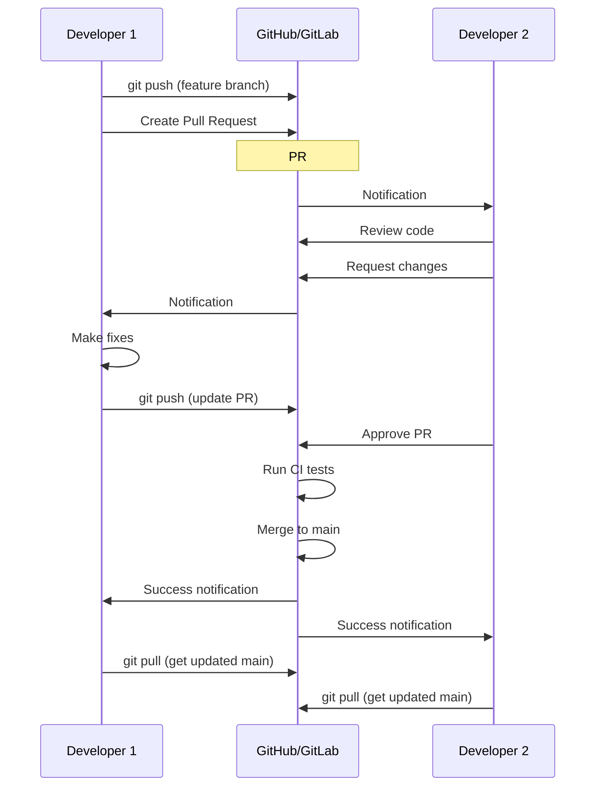

# Collaboration with Git

Git truly shines when working with a team. Understanding how to collaborate effectively—sharing code, reviewing changes, and managing remote repositories—is essential for modern development.

## The Collaboration Flow



## Remote Repositories

### Adding Remotes

```bash
# Clone automatically sets up 'origin' remote
git clone https://github.com/user/repo.git

# Add additional remotes
git remote add upstream https://github.com/original/repo.git

# View configured remotes
git remote -v
```

### Fetching and Pulling

```bash
# Fetch updates without merging
git fetch origin

# Pull = fetch + merge
git pull origin main

# Pull with rebase (cleaner history)
git pull --rebase origin main
```

### Pushing Changes

```bash
# Push to remote
git push origin feature-branch

# Set upstream and push
git push -u origin feature-branch

# Push all branches
git push --all origin

# Push tags
git push --tags
```

## Pull Requests (PRs) / Merge Requests (MRs)

Pull Requests are the primary collaboration mechanism on platforms like GitHub, GitLab, and Bitbucket.

### PR Best Practices

**Creating a Good PR:**

1. **Keep it focused**: One feature/fix per PR
2. **Write a clear title**: "Add user authentication" not "Updates"
3. **Provide context**: Explain what and why
4. **Include testing steps**: How to verify the changes
5. **Link related issues**: "Fixes #123"
6. **Keep it small**: Easier to review

**Example PR Description:**
```markdown
## What
Adds JWT-based user authentication

## Why
Users need secure login to access their dashboards

## How
- Implemented JWT token generation
- Added middleware for route protection
- Created login/logout endpoints

## Testing
1. Start server: `npm start`
2. POST to `/api/login` with credentials
3. Verify token in response
4. Access protected route with token

Fixes #42
```

### Code Review Process

**As a Reviewer:**
- Be constructive and specific
- Explain the "why" behind suggestions
- Acknowledge good code
- Test the changes locally if possible
- Use "Request Changes" or "Approve"

**As an Author:**
- Don't take feedback personally
- Ask questions if unclear
- Make requested changes promptly
- Thank reviewers for their time
- Respond to all comments

## Forking Workflow

For contributing to open-source projects:

```bash
# 1. Fork the repository on GitHub
# (Creates copy under your account)

# 2. Clone your fork
git clone https://github.com/YOUR-USERNAME/repo.git
cd repo

# 3. Add original repo as upstream
git remote add upstream https://github.com/ORIGINAL-OWNER/repo.git

# 4. Create feature branch
git checkout -b fix-typo

# 5. Make changes and commit
git commit -m "Fix typo in README"

# 6. Push to your fork
git push origin fix-typo

# 7. Create Pull Request from your fork to original repo

# 8. Keep your fork updated
git fetch upstream
git checkout main
git merge upstream/main
```

## Handling Distributed Teams

### Time Zone Challenges

```bash
# Use async communication
# - Write detailed commit messages
# - Document decisions in PRs
# - Use project documentation

# Stay updated
git fetch --all   # Get everyone's changes
git pull --rebase # Keep history clean
```

### Branch Protection

Protect important branches from accidental changes:

**GitHub Settings → Branches → Branch Protection:**
- Require PR reviews
- Require status checks
- Require linear history
- Require signed commits
- Restrict who can push

## Useful Collaboration Commands

```bash
# See who changed each line of a file
git blame filename.js

# Find when a bug was introduced
git bisect start
git bisect bad HEAD
git bisect good v1.0
# Git will help you find the problematic commit

# View another developer's branch
git fetch origin
git checkout -b feature-review origin/feature-branch

# Cherry-pick a specific commit
git cherry-pick abc123

# Show commits by author
git log --author="John Doe"
```

## Communication Tips

1. **Commit messages**: Write for future collaborators
2. **PR comments**: Be clear and respectful
3. **Documentation**: Update README with new features
4. **Issues**: Track bugs and features systematically
5. **Slack/Discord**: Discuss complex changes before coding

## Conflict Prevention

- **Communicate**: Let team know what you're working on
- **Pull frequently**: Stay synced with the team
- **Small commits**: Easier to merge
- **Code ownership**: Designate experts for different areas
- **Pair programming**: Share knowledge, reduce conflicts

Effective collaboration makes teams more productive and creates better software. Git provides the tools—communication and teamwork make it work!
