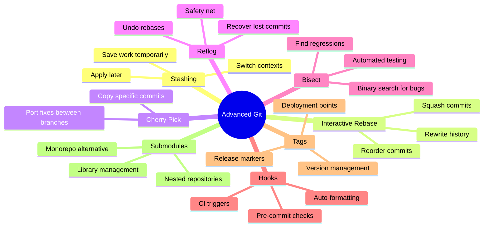

# Advanced Git Tips and Tricks

Once you're comfortable with Git basics, these advanced techniques will make you even more productive. These are the tools professional developers use daily to maintain clean histories and recover from mistakes.

## Advanced Git Commands



## Git Stash: Temporary Storage

Save work without committing:

```bash
# Save current changes
git stash

# Save with a message
git stash save "Work in progress on login form"

# List all stashes
git stash list

# Apply most recent stash
git stash apply

# Apply and remove from stash list
git stash pop

# Apply specific stash
git stash apply stash@{2}

# Drop a stash
git stash drop stash@{1}

# Clear all stashes
git stash clear
```

**Use cases:**
- Switch branches quickly without committing
- Pull latest changes while working
- Test something without losing current work

## Interactive Rebase: Rewrite History

Clean up commits before pushing:

```bash
# Rebase last 3 commits
git rebase -i HEAD~3

# Rebase back to specific commit
git rebase -i abc123
```

**Interactive rebase options:**
- `pick` - Keep commit as-is
- `reword` - Change commit message
- `edit` - Modify commit content
- `squash` - Combine with previous commit
- `fixup` - Squash but discard message
- `drop` - Remove commit

**Example:**
```bash
# Before: 3 messy commits
# abc123 - Fix bug
# def456 - Fix bug again
# ghi789 - Actually fix the bug

# After rebase -i HEAD~3: 1 clean commit
# abc123 - Fix login validation bug
```

⚠️ **Warning**: Never rebase commits that have been pushed to a shared branch!

## Cherry Pick: Copy Commits

Apply specific commits to current branch:

```bash
# Copy one commit
git cherry-pick abc123

# Copy multiple commits
git cherry-pick abc123 def456

# Copy a range of commits
git cherry-pick abc123..ghi789
```

**Use case:**
```bash
# Bug fix on feature branch needed in main
git checkout main
git cherry-pick bugfix-commit-hash
```

## Reflog: Git's Safety Net

Recover "lost" commits:

```bash
# View all ref changes
git reflog

# Recover lost commit
git reflog
# Find the commit hash you want
git checkout abc123

# Undo a bad rebase
git reflog
git reset --hard HEAD@{5}
```

**Reflog is your time machine** - it records every HEAD movement.

## Git Bisect: Bug Hunter

Find which commit introduced a bug:

```bash
# Start bisect
git bisect start

# Mark current as bad
git bisect bad

# Mark last known good commit
git bisect good v1.0

# Git checks out middle commit
# Test if bug exists
git bisect bad    # Bug present
# or
git bisect good   # Bug not present

# Git continues binary search
# Repeat until Git finds the problematic commit

# End bisect
git bisect reset
```

**Automated bisect:**
```bash
git bisect start HEAD v1.0
git bisect run npm test
# Git automatically finds first failing commit
```

## Git Tags: Version Markers

Mark important points in history:

```bash
# Create lightweight tag
git tag v1.0.0

# Create annotated tag (recommended)
git tag -a v1.0.0 -m "Release version 1.0.0"

# Tag specific commit
git tag -a v0.9.0 abc123 -m "Beta release"

# List tags
git tag

# Show tag details
git show v1.0.0

# Push tags to remote
git push origin v1.0.0
git push --tags

# Checkout tag
git checkout v1.0.0

# Delete tag
git tag -d v1.0.0
git push origin --delete v1.0.0
```

## Git Hooks: Automation

Scripts that run on Git events:

```bash
# Hooks are in .git/hooks/
cd .git/hooks

# Pre-commit hook (runs before commit)
# File: .git/hooks/pre-commit
#!/bin/bash
npm run lint
npm test
```

**Common hooks:**
- `pre-commit` - Linting, formatting
- `commit-msg` - Validate commit message format
- `pre-push` - Run tests before push
- `post-merge` - Update dependencies after merge

## Useful Aliases

Speed up your workflow:

```bash
# Set up aliases
git config --global alias.co checkout
git config --global alias.br branch
git config --global alias.ci commit
git config --global alias.st status
git config --global alias.unstage 'reset HEAD --'
git config --global alias.last 'log -1 HEAD'
git config --global alias.visual 'log --oneline --graph --all'

# Now use them
git co main
git br -a
git ci -m "Update"
git visual
```

## Clean Up Strategies

Keep repository tidy:

```bash
# Delete merged branches
git branch --merged | grep -v "\*" | xargs -n 1 git branch -d

# Remove remote-tracking branches that no longer exist
git fetch --prune

# Clean untracked files (careful!)
git clean -n  # Preview
git clean -f  # Delete files
git clean -fd # Delete files and directories

# Garbage collection
git gc --aggressive --prune=now
```

## Troubleshooting Commands

```bash
# Undo last commit (keep changes)
git reset --soft HEAD~1

# Undo last commit (discard changes)
git reset --hard HEAD~1

# Amend last commit
git commit --amend

# Change author of last commit
git commit --amend --author="Name <email@example.com>"

# View file from another branch
git show other-branch:path/to/file.txt

# Restore deleted file
git checkout HEAD -- deleted-file.txt
```

## Pro Tips

1. **Use `.gitignore` wisely**: Keep it updated
2. **Sign commits**: Use GPG for verification
3. **Write scripts**: Automate repetitive tasks
4. **Learn your platform**: GitHub/GitLab have CLI tools
5. **Practice on test repos**: Try dangerous commands safely

## When to Use What

- **Stash**: Quick context switching
- **Rebase**: Clean up before merging
- **Cherry-pick**: Port specific changes
- **Bisect**: Find bug introduction
- **Reflog**: Recover from mistakes
- **Hooks**: Enforce standards
- **Tags**: Mark releases

Master these techniques and you'll handle any Git situation with confidence!
